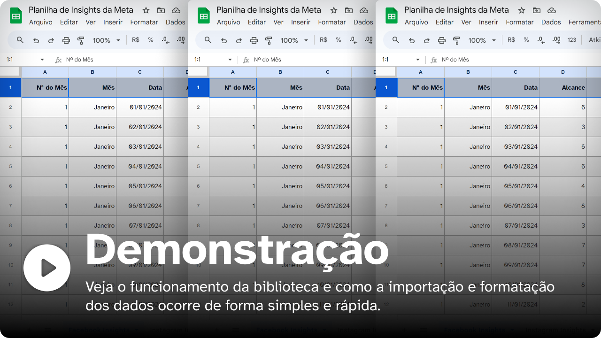

# Planilha de Insights da Meta (Apps Script)

Analise o resultado de parcerias com influenciadores digitais, veja desempenho dos seus perfis durante campanhas de anúncios ou obtenha uma visão geral sobre as tendências de alcance, visitas e seguidores para os seus ativos do Facebook Business.

Com a biblioteca de Planilha de Insights da Meta é possível criar uma fonte de dados facilmente atualizável para ser importada em ferramentas de análise dados como o Google Looker Studio ou o Microsoft Power BI, sem a necessidade de pagar por conectores de terceiros.

> Esse é uma biblioteca para uso no Planilhas do Google (Google Sheets). Confira o código no ar [clicando aqui ↗](https://script.google.com/d/1an7afo5BniwmcM5DJCrdHggFf-6D1oNrNkZZUmjTCuP1-asBJ6VLdfvP/edit?usp=sharing).

---

## Demonstração 📊
Crie e mantenha uma planilha com as principais métricas dos perfis no Facebook e Instagram facilmente, com automações para facilitar a inserção de dados baixados manualmente do Meta Business Suite.

Veja o vídeo de demonstração de uso abaixo:

[_Baixe o vídeo_](#)

### Benefícios
Essa biblioteca ajuda você a aumentar a sua produtividade e manter a consistência no trabalho de todos os seus clientes!

- 🤩 Fácil e intuitiva.
- 🪄 Consistência de layout e informações.
- 📄 Importe como fonte de dados facilmente.
- 🤝 Compartilhe acesso com seus colegas de trabalho.
- 🏅 Licença de domínio público.
  - Um conhecimento básico de JavaScript é recomendado para realizar alterações no código.

---

## Utilizando a biblioteca 🪄

O Calendário de Datas Comemorativas conta com diversas funções úteis e intuitivas para que você possa começar a trabalhar imediatamente após a configuração inicial! Veja abaixo os primeiros passos:

### 1️⃣: Crie uma planilha para cada plataforma

No menu de opções da interface do Google Sheets, clique em "🤖 Assistente", em seguida, clique em "Primeiros passos", e, por fim clique para criar as planilhas para o Facebook e Instagram Insights. É possível utilizar a ferramenta com apenas uma das duas opções também.

### 2️⃣: Obtenha os dados do Meta Insights

Com a planilha em mãos, visite o [Meta Business Insights ↗](https://business.facebook.com/insights), escolha os ativos (página do Facebook ou conta do Instagram), defina o período dos dados e exporte os gráficos de Alcance, Visitas e Seguidores em CSV.

### 3️⃣: importe os dados para planilha

Por fim, volta à planilha e importe cada gráfico separadamente, com a opção de "Inserir novas planilhas". Feito isso, clique novamente no menu "🤖 Assistente" e clique nas opções para importar Alcance, Visitas e Seguidores. A biblioteca fará o trabalho duro sozinho e logo você terá sua planilha populada para uso como fonte de dados em plataformas como Google Looker Studio ou Power BI.

---

👨🏽‍💻 Criado por [André Moura Santos 🡕](https://andremourasantos.com.br/?utm_source=github&utm_medium=repositories&utm_campaign=planilha-meta-insights), 2024, licença MIT.